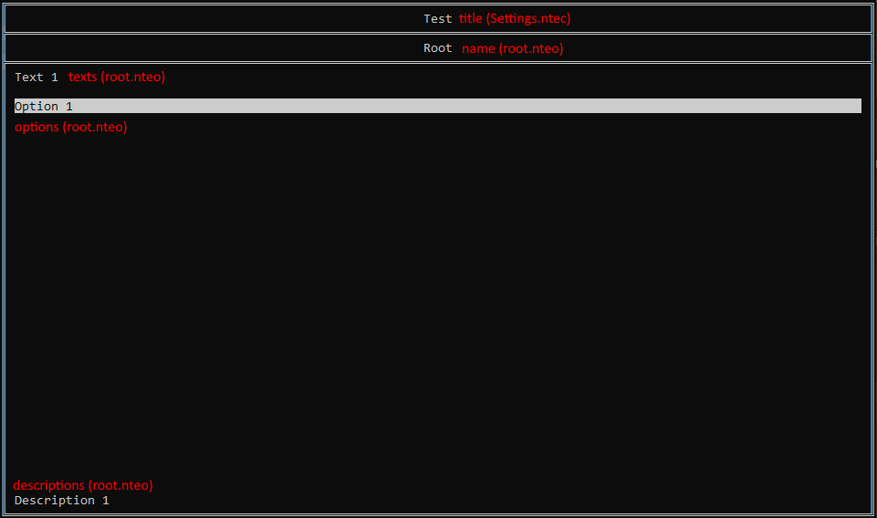

#  Manual build

To be able to manually build your own NTE, you will have to first know how everything is structured.

Every NTE is stored inside the "data" folder. To make a new NTE, create a folder inside it.

#### Folder
```
data
└── Test
```

Then, you have to set up your NTE's settings. To do that, create a file named "Settings.ntec" (.ntec is for NTE config files). This file should be formatted like a .json file.

Inside the "Settings.ntec" file, you will have to values: "title" and "panels." The only value you need to change is title, because panels will be automatically updated once it is loaded.

#### Settings.ntec
```
{
    "title": "Test",
    "panels": 0
}
```

Now, onto creating the actual panels. You need to create a folder inside your NTE's folder named "panels." In here, you will create a file called "root.nteo" (.nteo is for NTE object files).

#### Folder
```
data
└── Test
    ├── panels
    │   └── root.nteo
    └── Settings.ntec
```

Inside the "root.nteo" file, the two values that will always be there are "name" and "type."

The "name" value will be used as the header of the panel and the "type" value will tell the NTE loader which type of panel it is (There are three options: "option," "text," and "input")

### "type": "option"


#### root.nteo
```
{
    "name": "Root",
    "type": "option",
    "options": ["Option 1"],
    "functions": [nil]
}
```

### "type": "text"


#### root.nteo
```
{
    "name": "Root",
    "type": "text",
    "texts": ["Text 1"],
    "options": ["Option 1"],
    "functions": [nil]
}
```

### "type": "input"


#### root.nteo
```
{
    "name": "Root",
    "type": "input",
    "texts": ["Text 1"],
    "input": "Input: ",
    "command": [nil]
}
```

As you may have noticed, .nteo files with an "options" value also have a "functions" value, and those with an "input" value have a "command" value. Currently, there are three commands: "goto," "delete," and "exit."

### goto
The "goto" command lets you move to any panel inside the "panels" folder by typing their name (without file extension)

#### Synopsis
`goto <name>`

If you have another panel, and you want to be able to go to it from one of the options inside your root, you can just write this:

#### root.nteo
```
{
    "name": "Root",
    "type": "option,
    "options": ["Things"],
    "functions": ["goto Things"],
    "descriptions": ["Go to panel Things"]
}
```

#### Folder
```
data
└── Test
    ├── panels
    │   ├── root.nteo
    │   └── Things.nteo
    └── Settings.ntec
```

### delete
The "delete" command lets you delete any part of the data folder.

#### Synopsis
`delete [file | all] <nte> <name>`

If you have another panel, and you want it to be able to delete it from one of the options inside your root, you can just write this:

#### root.nteo
```
{
    "name": "Root",
    "type": "option,
    "options": ["Delete Things"],
    "functions": ["delete file Test Things"],
    "descriptions": ["Deletes the panel Things"]
}
```

#### Folder
```
data
└── Test
    ├── panels
    │   ├── root.nteo
    │   └── Things.nteo
    └── Settings.ntec
```

### exit
The "exit" command just closes the window.