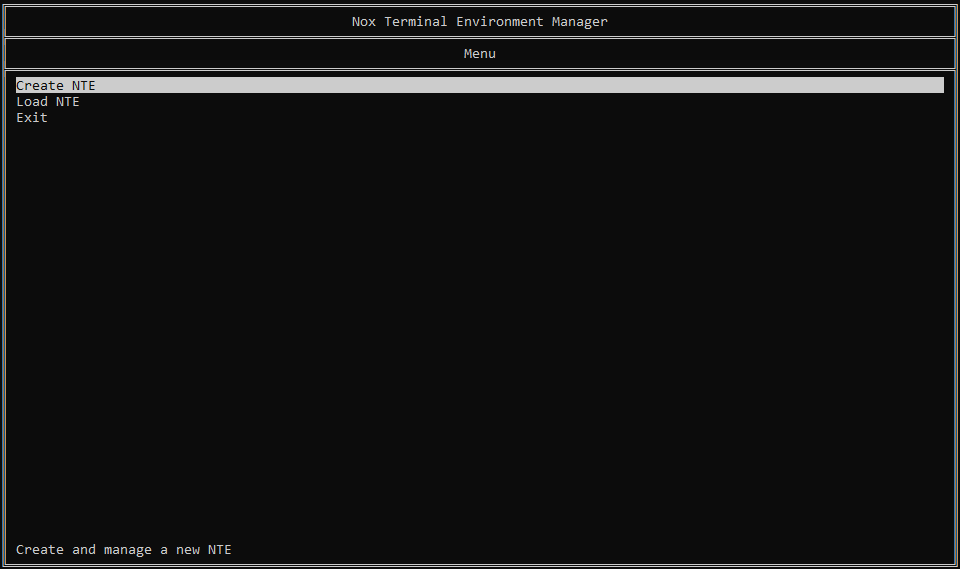

#  NTE

## About

NTE stands for Nox Terminal Environment, a TUI (Text User Interface) loader and builder.

It works by handling each section as a JSON file, having properties that define it. This is then loaded and displayed on a python file.

For ease of use, the NTE Manager (NTEM) file exists which makes the process of building your own TUI much easier with its own interactive TUI. (Fun fact: Its functions are entirely created using NTE)

## How to use

To get started, open the NTEM file and select the "Create NTE" option.

You will be asked to write the name of your TUI and after finishing, a "Manage" section will pop up where you can start adding elements to your TUI.

The heart of your TUI lies on its "root" panel, the one that will appear once you load it. Selecting the option will ask you to give a name to the panel. After being done, you will see the panel listed on the "Manage" section in the format "custom-name (file-name)."

With your root panel created, you will now be shown the panel whenever you load the TUI. Though, it will be empty as we have not added any option or text. To edit it, you just enter the panel you want to modify and you will see a variety of options which will let you change the main aspects of the panel.